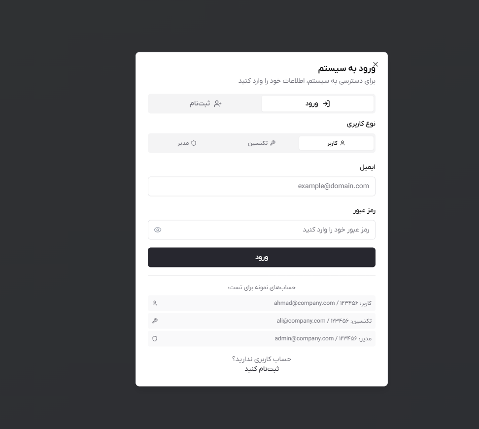
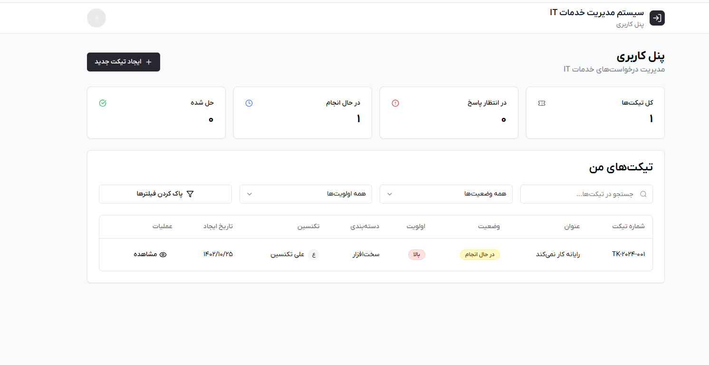
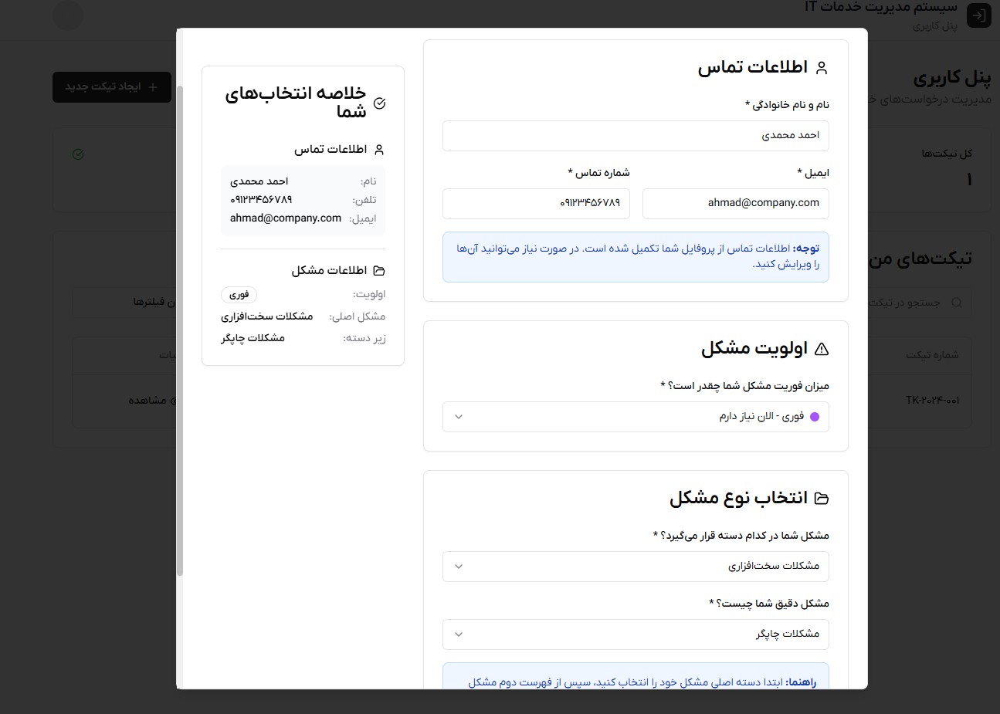
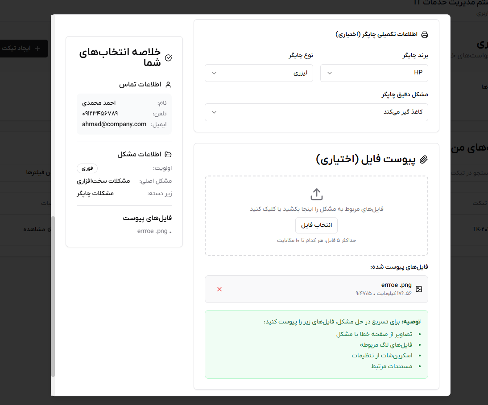
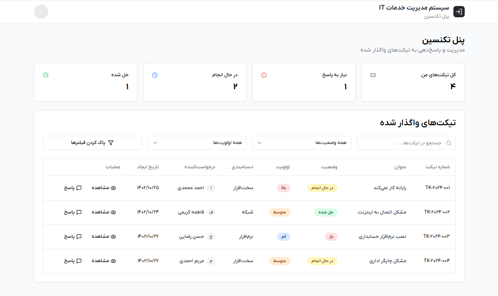
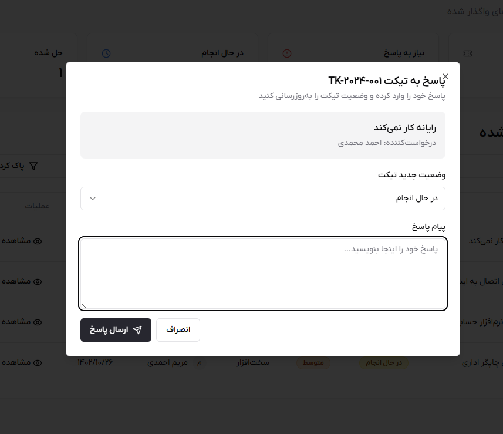
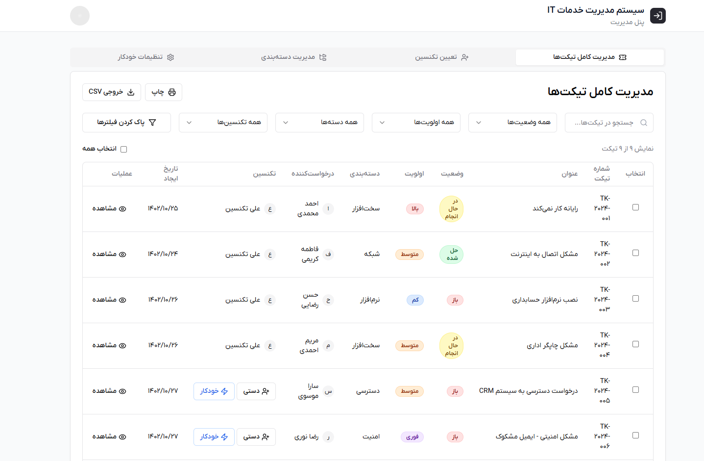
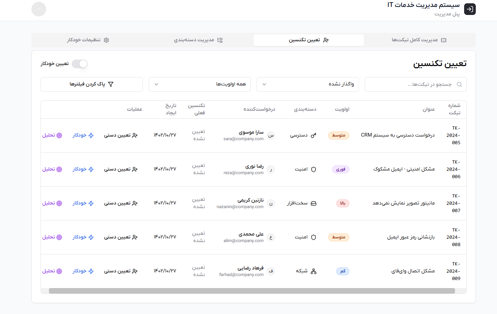
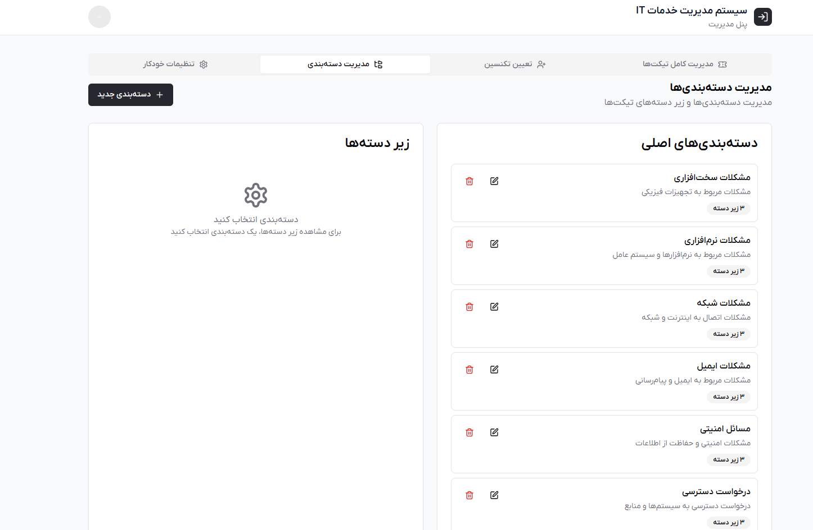
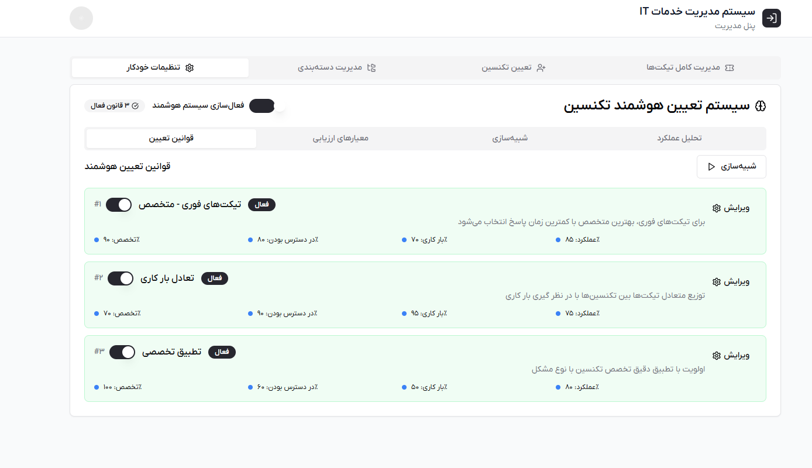

# IT Service Managment System (Farsi RTL) 

A full functional, RTL-compatible ticketing dashboard designed for technical support teams, end-users, and IT administrators. 

## 🎯 Project Objective


This system was built to simplify the process of reporting, ticketing, and resolving technical issues within an organization. It supports role0-based dashboards for clients, technicians, and admins-all presented in a modern, mobile-friendly Farsi interface. 

----

## 🧩 Key Features

### 🎫 Ticketing Module 

- Two-step dynamic ticket submission form
- Category and  suncategory selection
- Priority assignment and file upload support
- Status tracking and user feedback

### 👨‍💻 Client Dashboard

- View submitted tickets
- Filter by status (waiting, in progress, answered)
- View technician responses
- Toggle Theme (light/dark) and language


### 🛠️ Technician Dashboard

- Manage categories and subcategories
- Assign tickets to technicians
- Configure auto-assignment rules
- View ticket analytics

### ⚙️ Additional Features 

- Full RTL (Right-to-Left)
- Custom Persian font (IranYekan)
- Responsive design for all devices
- Theme tigglking (light/datk)
- Role-based context and authentication
- Built with scalable component structer

  ---

  ## 🛠️ Tech Stack

| Area           | Tools & Frameworks                                   |
|----------------|------------------------------------------------------|
| Frontend       | Next.js 14 (App Router), React 18, TypeScript        |
| Styling        | Tailwind CSS, ShadCN UI, Radix UI                    |
| Forms & State  | React Hook Form, Yup, Context API                    |
| UI/UX          | Lucide React Icons, Modern Farsi Design              |
| Fonts          | IRANYekan (locally hosted)                           |
| Deployment     | Ready for deployment on Vercel, Netlify, or others  |

  

---

## 🚀 Getting Started

# 1. Clone the repository

```bash

git clone https://github.com/alirazi1992/Pro-Ticketing-ITs-Service-Management-.git
cd Pro-Ticketing-ITs-Service-Management-
```

# 2 Install dependencies

```bash
npm install 
```

# 3.Run the development server 

```bash
npm run dev

```
Then open:

http://localhost:3000

----

# 🔐 Role-Based Access & Routes

| Role           | Dashboard Path       |
|----------------|----------------------|
| Client         | `/client/dashboard`  |
| Technician     | `/engineer/dashboar` |
| Admin          | `/admin/dashboardI`  |


----

# 📁 Project Structure

app/

├── client/

├── engineer/

├── admin/

├── components/

│  
    ├── ui/
│   
    ├── forms/
│  
    └── shared/

├── lib/

├── public/

├── styles/

└── types/

----

# 📷 Screenshots

| Login/Signup | Client Dashboard | Ticket View 1 |
|--------------|------------------|---------------|
|  |  |  |

| Ticket View 2 | Technician Dashboard | Ticket Response |
|---------------|----------------------|-----------------|
|  |  |  |

| Admin Dashboard | Technician Assignment | Category Assignment |
|-----------------|------------------------|----------------------|
|  |  |  |

| AI Technician Auto-Selection | |
|-----------------------------|--|
|  | |


----

# 👨‍💻 Author

-  Developer : **Ali Razi**
-  Contact: https://www.linkedin.com/in/alirazi1992


